# VMWare 虚拟机的安装及Linux C++环境的搭建

## 一)  虚拟机的安装

虚拟机VMWare的安装：

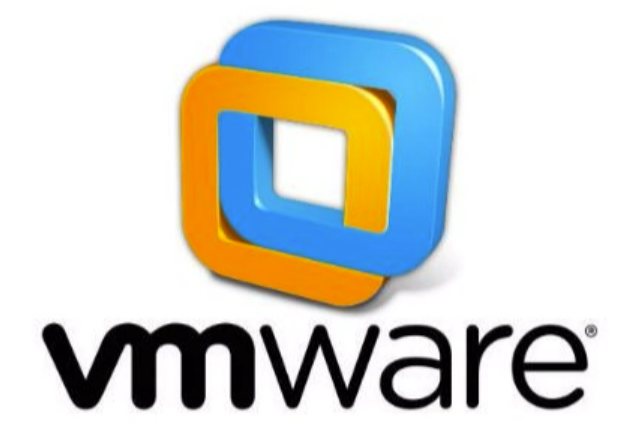

官网地址：

​	 https://www.vmware.com/cn.html

课程提供的下载路径：

​      https://pan.baidu.com/s/1uFlYncpzV_t70MM9psw-sg    提取码：mjn1

安装过程：

​	  VMware的安装过程比较简单，与安装普通软件差别不大。

​	  

下载并解压文件后：

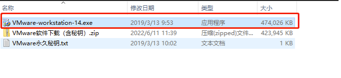

双击安装，基本保持默认设置，下一步就可以

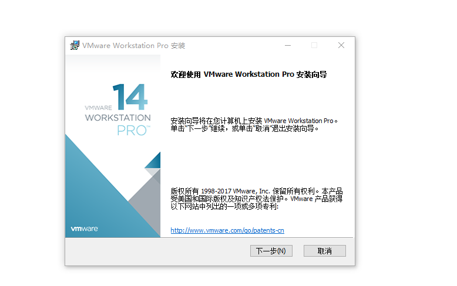

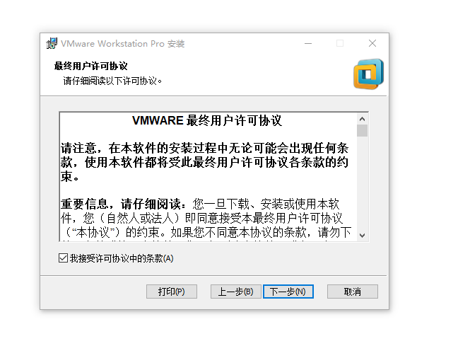

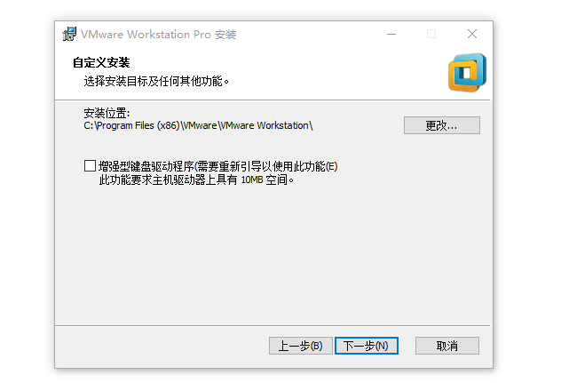

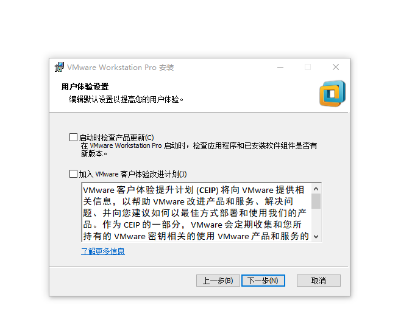

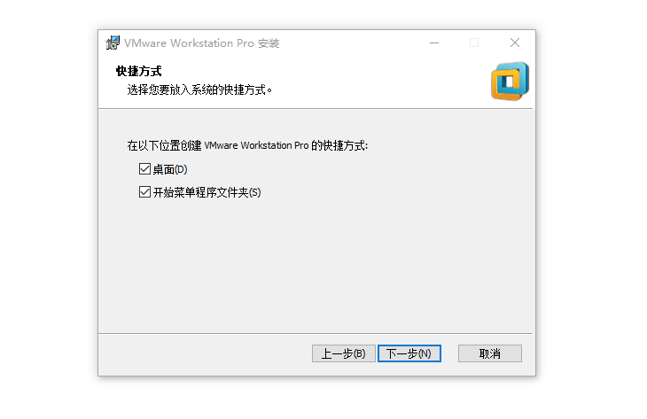

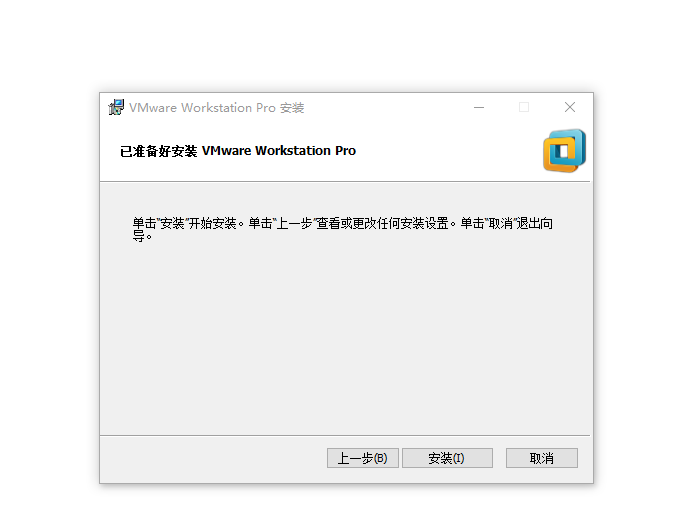

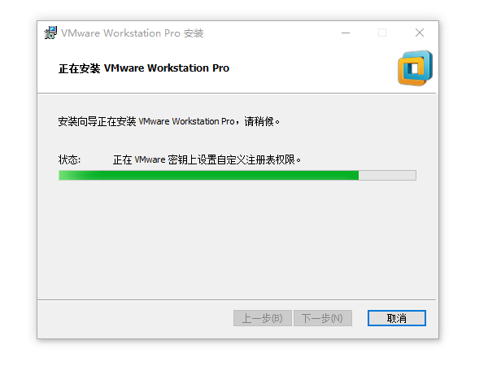

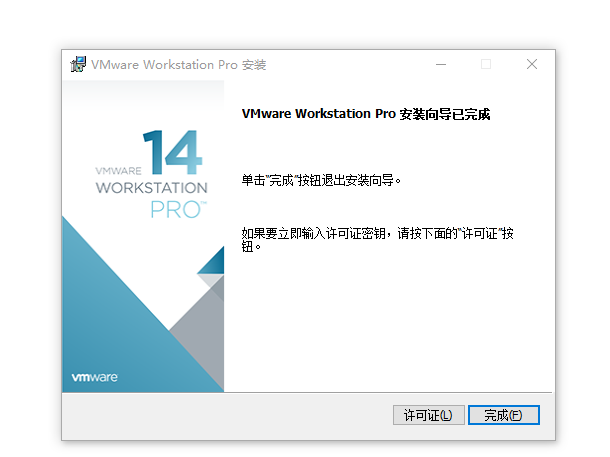

输入激活密钥：

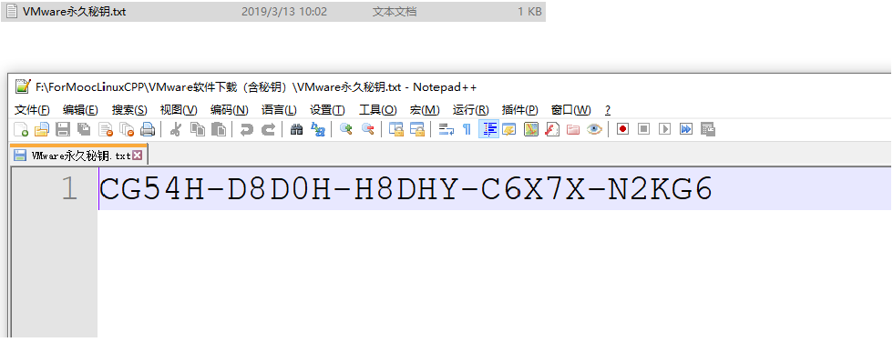

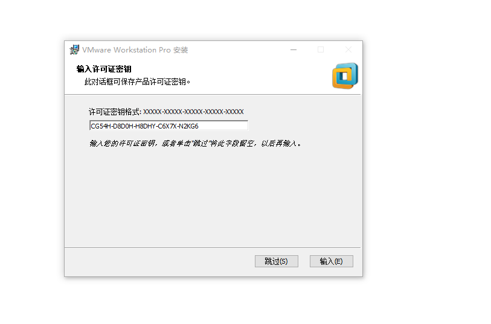

## 二)   Linux系统的安装

课程提供的下载路径：

​      https://pan.baidu.com/s/1NRNE9cmI-HEnYRc3BNGPhw    提取码：y6ct

安装过程：

​	 本文件压缩后解压，然后可直接打开文件导入虚拟机，非常方便。

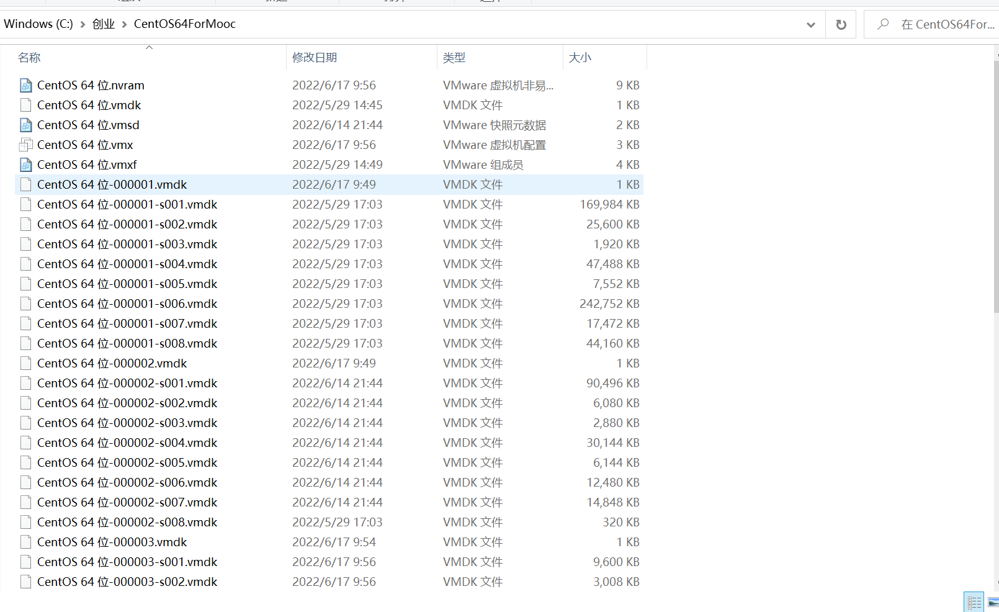

开启VMWare虚拟机，点击文件 —》打开：

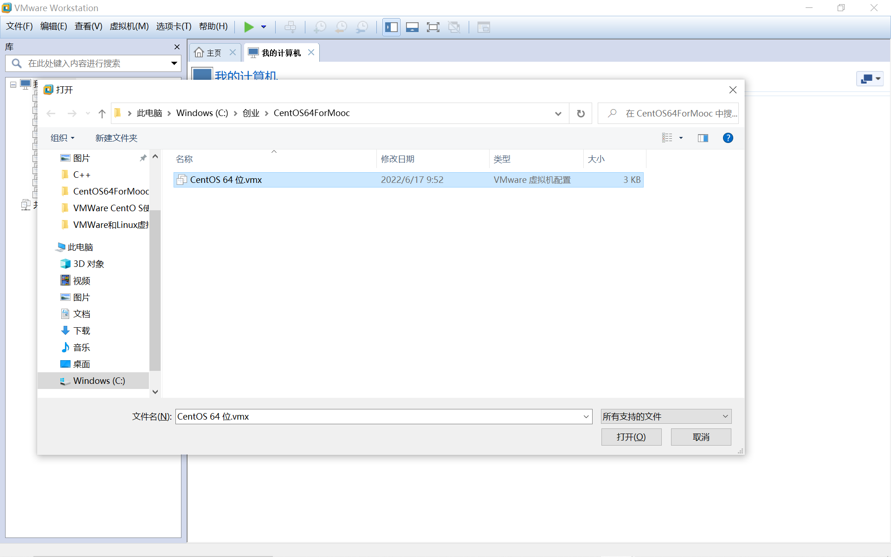

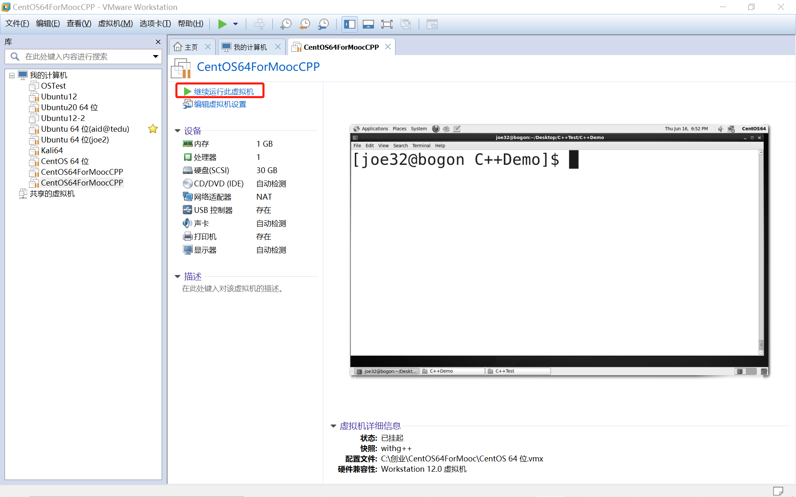

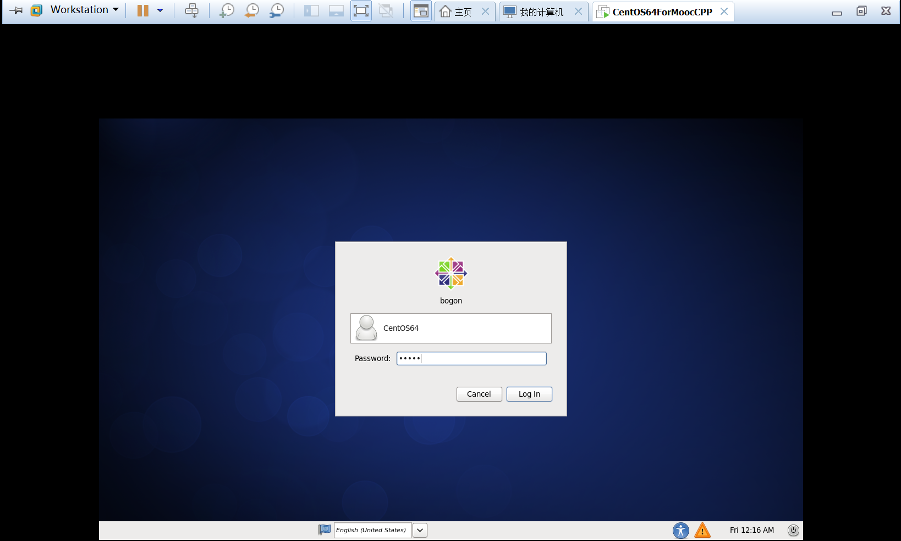

注意：默认用户为：joe32

**默认用户和管理员密码都是:joe32**

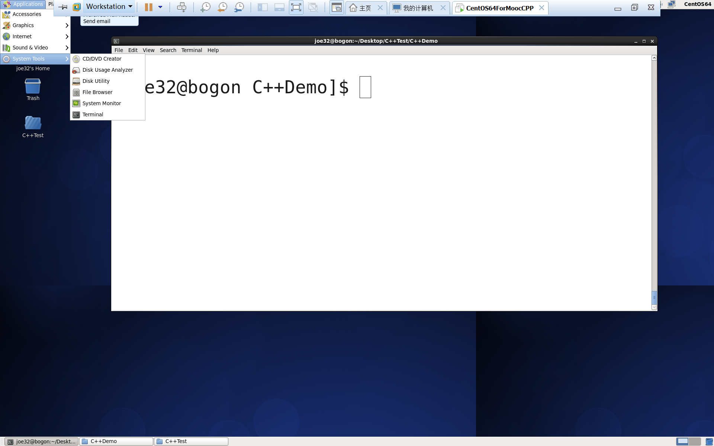

##### 可能遇到的问题：

1. 网络配置：

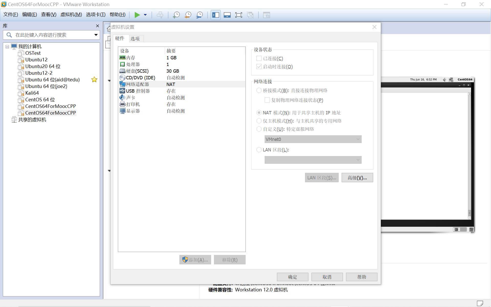

VMWare虚拟化问题：

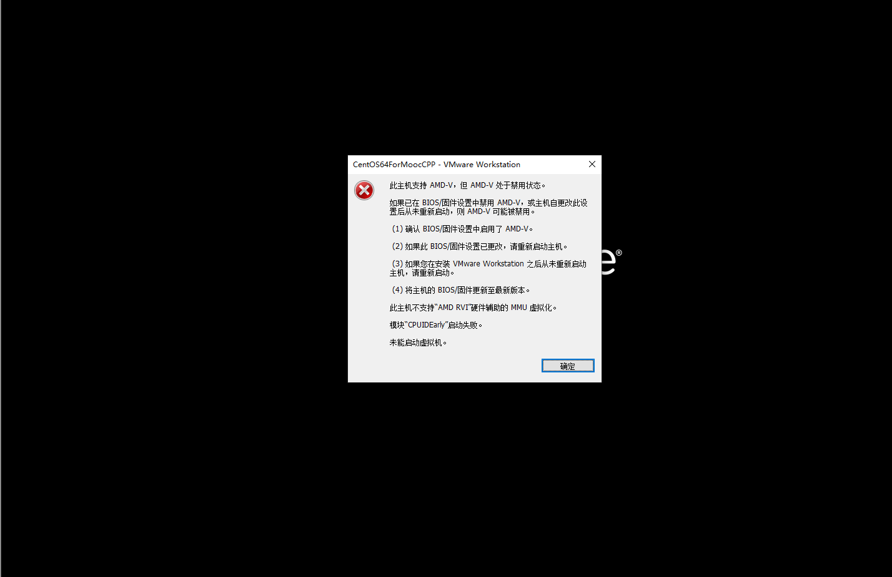

需要修改机器的BIOS设置，并保存重启。

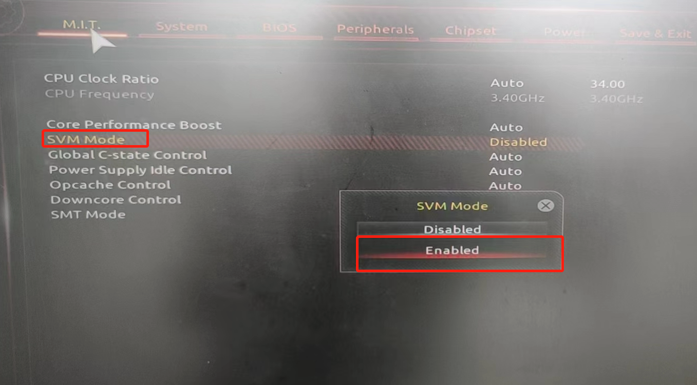

## 三)   GCC及G++的安装

1. 安装的工作已经在虚拟机中完成

2. **测试环境**： 

   使用简单的命令测试环境是否正常

   gcc --version

   g++ --version

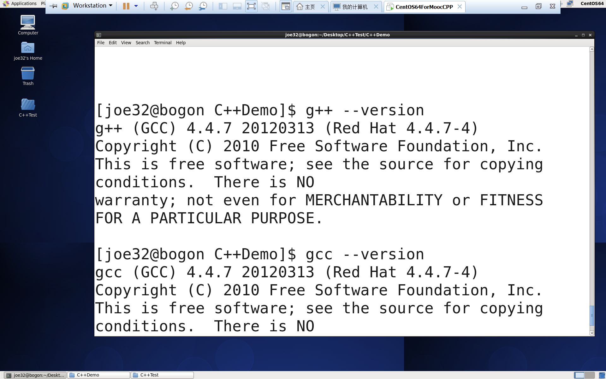